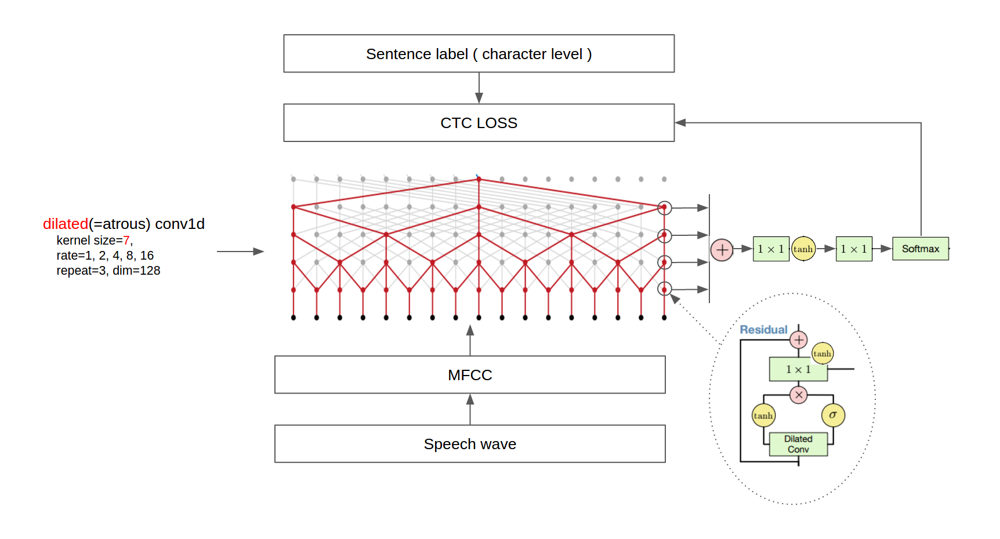

### STT-Wavenet
Python and C++ implementation of end-to-end sentence level Speech Recognition using DeepMind's recent research on audio processing and synthesis. This is based on [WaveNet: A Generative Model for Raw Audio](https://arxiv.org/pdf/1609.03499.pdf) where DeepMind proposed a neural network architecture that could generate human-like audio from text, the model is also capable of performing speech-to-text. This repo provides speech-to-text implementation of Wavenet. The model takes Mel-spectograph as input and produces text as output using wavenet + beam search decoder.



#### Modifying the architecture/making changes to the exporter:
Those who wish to modify or play with wavenet architecture can go to `core` directory.
Refer [README.md](./core/README.md)

#### Building C++ api (libtensorflow_cc)
TO build C++ api, you have to build tensorflow from scratch along with its dependencies as a monolithic shared library, also make sure the headers are properly exported. If you don't want to build tensorflow, use pre-built shared libraries from [FloopCZ/tensorflow_cc](https://github.com/FloopCZ/tensorflow_cc). I would recommend building tensorflow from scratch as it properly compiles to your hardware, using prebuilt shared libraries can lead to segmentation faults and illegal instruction execution attempts as they would have compiled tensorflow with different versions of gcc and different hardware optminzations that your processor lacks.

##### Building tensorflow from scratch:
1. Install bazel and clone tensorflow repository, run `config` script and answer the questions carefully.
2. Build `libtensorflow_cc`:
    ```
    bazel build -c opt --config monolithic //tensorflow:libtensorflow_cc.so
    ```
3. Export headers:
    ```
    bazel build -c opt --config monolithic //tensorflow:install_headers
    ```
##### Build the wavenet module
1. Install `pybind11` and python headers.
    ```
    sudo apt install python3-dev &&
    pip3 install pybind11
    ```
2. Go to `platform/buld_env`
3. Make sure you properly set these env variables:
    ```shell
    TENSORFLOW_CC_LIBS_PATH=${HOME}/Documents/installation/tensorflow/lib        #libtensorflow_cc.so* directory
    TENSORFLOW_CC_INCLUDE_PATH=${HOME}/Documents/installation/tensorflow/include #tensorflow headers directory

    #misc : keep them default
    present_dir=$(pwd)
    SST_SOURCE_DIR=${present_dir}/../cc/src 
    SST_INCLUDE_PATH=${present_dir}/../cc/include
    SST_PYTHON_PATH=${present_dir}/../wavenetsst/wavenetpy
    ```
4. Build wavenet CPython module
    ```
    ./tensorflow_env.sh python
    ```


##### Using python wavenet module 
The wavenet python module wavenetpy is located at `platform/wavenetstt`, the module requires wavenet CPython shared library. Since static build is yet to be implemeted, the shared library dynamically links with `libtensorflow_cc` during runtime. So, make sure you export a proper `LD_LIBRARY_PATH`.

```shell
TENSORFLOW_CC_LIBS_PATH=${HOME}/Documents/installation/tensorflow/lib
LD_LIBRARY_PATH=${LD_LIBRARY_PATH}:${TENSORFLOW_CC_LIBS_PATH}
```

Install requirements -> numpy and librosa
```
pip3 install -r requirements.txt
```

Example : Running speech recognition
```python3
from wavenetpy import WavenetSTT
#load the model
wavenet = WavenetSTT('../../pb/wavenet-stt.pb')

#pass the audio file
result = wavenet.infer_on_file('test.wav')
print(result)
```

##### TODO and Roadmap:
1. Build static library to avoid dynamic linking with `libtensorflow_cc`
2. We are using `librosa` for MFCC, the goal is to use custom C++ implementation.
3. Use custom C++ `ctc_beam_search_decoder` because it is not supported in tensorflow lite.
4. Provide a Dockerfile
5. Implement Tensorflow Lite implementation for embedded devices and android.
6. Add Tensorflow.js support.
7. Optimize C++ code.
8. Provide CI/CD pipeline for C++ build. 
9. Provide a way to directly access mfcc pointer instead of memory copy. This is not possible as now because of the limitation in Tensorflow C++ api. In other words, add a custom memory allocator for tensors.

##### Contributor guide
We welcome contributors especially beginners. Contributors can :
1. Raise issues
2. Suggest features
3. Fix issues and bugs
4. Impelement features specified in TODO and Roadmap.

##### Acknowledgements
1. Deepmind
2. [buriburisuri](https://github.com/buriburisuri/speech-to-text-wavenet) for providing the pretrained ckpt files and `wavenet.py`.
3. [kingscraft](https://github.com/kingstarcraft/speech-to-text-wavenet2) for tensorflow reference implementation.
3. Stackoverflow and Tensorflow Docs
